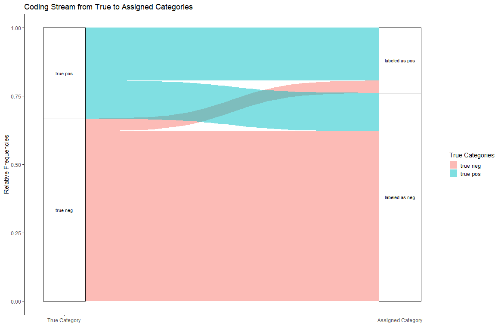

```{r, include = FALSE}
knitr::opts_chunk$set(
  collapse = TRUE,
  comment = "#>"
)
library(aifeducation)
```

# 1 Introduction and Overview

In the educational and social sciences, the assignment of an observation
to scientific concepts is an important task that allows researchers to
understand an observation, to generate new insights, and to derive
recommendations for research and practice.

In educational science, several areas deal with this kind of task. For
example, diagnosing students' characteristics is an important aspect of a
teachers' profession and necessary to understand and promote learning.
Another example is the use of learning analytics, where data about
students is used to provide learning environments adapted to their
individual needs. On another level, educational institutions such as
schools and universities can use this information for data-driven
performance decisions (Laurusson & White 2014) as well as where and how
to improve it. In any case, a real-world observation is aligned to
scientific models to use scientific knowledge as a technology for
improved learning and instruction.

Supervised machine learning is one concept that allows a link between
real-world observations and existing scientific models and theories
(Berding et al. 2022). For educational sciences this is a great
advantage because it allows researchers to use the existing knowledge
and insights for applications of AI. The drawback of this
approach is that the training of AI requires both information about the
real world observations and information on the corresponding alignment
with scientific models and theories.

A valuable source of data in educational science are written texts,
since textual data can be found almost everywhere in the realm of
learning and teaching (Berding et al. 2022). For example, teachers often
require students to solve a task which they provide in a written form.
Students have to create a solution for the tasks which they often
document with a short-written essay or a presentation. This data can be
used to analyze learning and teaching. Teachers' written tasks for their
students may provide insights into the quality of instruction while
students' solutions may provide insights into their learning outcomes
and prerequisites.

AI can be a helpful assistant in analyzing textual data since the
analysis of textual data is a challenging and time-consuming task for
humans. In this
vignette, we would like to show how to create an AI that can help
you with such tasks by using the package *aifedcuation*.

**Please note that an introduction to content analysis, natural language
processing or machine learning is beyond the scope of this vignette. If
you would like to learn more, please refer to the cited literature.**

Before we start it is necessary to introduce a definition of our
understanding of some basic concepts since applying AI to educational
contexts means to combine the knowledge of different scientific
disciplines using different, sometimes overlapping concepts. Even within
a research area, concepts are not unified. Figure 1 illustrates this
package's understanding.

{width="100%"}

Since *aifeducation* looks at the application of AI for classification
tasks from the perspective of the empirical method of content analysis,
there is some overlapping between the concepts of content analysis and
machine learning. In content analysis, a phenomenon like performance and
colors can be described as a scale/dimension which is made up by several
categories (e.g. Schreier 2012 pp. 59). In our example, an exam's
performance (scale/dimension) could be "good", "average" or "poor". In
terms of colors (scale/dimension) categories could be "blue", "green",
etc. Machine learning literature uses other words to describe this kind
of data. In machine learning, "scale" and "dimension" correspond to the
term "label" while "categories" refer to the term "classes" (Chollet,
Kalinowski & Allaire 2022, p. 114).

With these clarifications, classification means that a text is assigned
to the correct category of a scale or that the text is labeled with the
correct class. As Figure 2 illustrates, two kinds of data are necessary
to train an AI to classify text in line with supervised machine learning
principles.

{width="100%"}

By providing AI with both the textual data as input data and the
corresponding information about the class as target data, AI can learn
which texts imply a specific class or category. In the above exam
example, AI can learn which texts imply a "good", an "average" or a
"poor" judgment. After training, AI can be applied to new texts and
predict the most likely class of every new text. The generated class can
be used for further statistical analysis or to derive recommendations
about learning and teaching.

To achieve this support by an artificial intelligence, several steps are
necessary. Figure 3 provides an overview integrating the functions and
objects of *aifeducation*.

{width="100%"}

The first step is to transform raw texts into a form computers can use.
That is, the raw texts must be transformed into numbers. In modern
approaches, this is usually done through word embeddings. Campesato
(2021, p. 102) describes them as "the collective name for a set of
language modeling and feature learning techniques (...) where words or
phrases from the vocabulary are mapped to vectors of real numbers." The
definition of a word vector is similar: „Word vectors represent the
semantic meaning of words as vectors in the context of the training
corpus." (Lane, Howard & Hapke 2019, p. 191)

Campesato (2021, pp. 112) clusters approaches for creating word
embeddings into three groups, reflecting their ability to provide
context-sensitive numerical representations. Approaches in group one do
not account for any context. Typical methods rely on bag-of-words
assumptions. Thus, they are normally not able to provide a word
embedding for single words. Group two consists of approaches such as
word2vec, GloVe (Pennington, Socher & Manning 2014) or fastText, which
are able to provide one embedding for each word regardless of its
context. Thus, they only account for one context. The last group
consists of approaches such as BERT (Devlin et al. 2019), which are able
to produce multiple word embeddings depending on the context of the
words.

From these different groups, *aifedcuation* implements several methods.

-   **Topic Modeling:** Topic modeling is an approach that uses
    frequencies of tokens within a text. The frequencies of the tokens
    are models as the observable variables of one more latent topic
    (Campesato 2021, p. 113). The estimation of a topic model is often
    based on a Latent Dirichlet Analysis (LDA) which describes each text
    by a distribution of topics. The topics themselves are described by
    a distribution of words/tokens (Campesato 2021, p. 114). This
    relationship between texts, words, and topics can be used to create
    a text embedding by computing the relative amount of every topic in
    a text based on every token in a text.
-   **GlobalVectorClusters:** GlobalVectors is a newer approach which
    utilizes the co-occurrence of words/tokens to compute GlobalVectors
    (Campesato 2021, p. 110). These vectors are generated in a way that
    tokens/words with a similar meaning are located close to each other
    (Pennington, Socher & Manning 2014). In order to create a *text*
    embedding from *word* embeddings, *aifeducation* groups tokens into
    clusters based on their vectors. Thus, tokens with a similar meaning
    are members of the same cluster. For the *text* embedding, the
    tokens of a text are counted for every cluster and the frequencies
    of every cluster for that text are used as a numerical
    representation of that text.
-   **Transformers:** Transformers are the current state-of-the-art
    approach for many natural language tasks (Tunstall, von Werra & Wolf
    2022, p. xv). With the help of the self-attention mechanism (Vaswani
    et al. 2017), they are able to produce context-sensitive *word*
    embeddings (Chollet, Kalinowski & Allaire, 2022 pp.366). 

All the approaches are managed and used with a unified interface
provided by the object `TextEmbeddingModel`. With this object you can
easily convert raw texts into a numerical representation, which you can
use for different classification tasks at the same time. This makes it
possible to reduce computational time. The created text embedding is
stored in an object of class `EmbeddedText`. This object additionally
contains information about the text embedding model that created this
object.

In the very best case you can apply an existing text embedding model by
using a transformer from [Huggingface](https://huggingface.co/) or by
using a model from colleagues. If not, *aifeducation* provides several
functions allowing you to create your own models. Depending on the
approach you would like to use, different steps are necessary. In the
case of Topic Modeling or GlobalVectorClusters, you must first create a
draft of a vocabulary with the two functions
`bow_pp_create_vocab_draft()` and `bow_pp_create_basic_text_rep()`. When
calling these functions, you determine central properties of the
resulting model. In the case of transformers, you first have to
configure and to train a vocabulary with `create_xxx_model()` and in a
next step you can train your model with `train_tune_xxx_model()`. Every
step will be explained in the next chapters. Please note that `xxx`
stands for different architectures of transformers that are supported
with *aifedcuation*.

With an object of class `TextEmbeddingModel` you can create the input
data for the supervised machine learning process. Additionally, you need
the target data which must be a named factor containing the
classes/categories of each text.

With both kinds of data, you are able to create a new object of class
`TextEmbeddingClassifierNeuralNet` which is the classifier. To train the
classifier you have several options which we will cover in detail in
chapter 3. After training the classifier you can share it with other
researchers and apply it to new texts. Please note that the application
to new texts requires the text to be transformed into numbers with
*exactly the same text embedding model* before passing the text to the
classifier. Please note: Do not pass the raw texts to the classifier,
only embedded texts work!

In the next chapters, we will guide you through the complete process,
starting with the creation of the text embedding models.

**Please note that the creation of a new text embedding model is only
necessary if you cannot rely on an existing model or if you cannot rely
on a pre-trained transformer.**

# 2 Start Working
# 2.1 Starting a New Session
Before you can work with *aifeducation* you must set up a new *R*
session. First, it is necessary that you load the library. Second, you
must set up python via reticulate. In case you installed python as
suggested in vignette [01 Get started](aifeducation.html) you
may start a new session like this:

```{r, include = TRUE, eval=FALSE}
reticulate::use_condaenv(condaenv = "aifeducation")
library(aifeducation)
```

Next you have to choose the machine learning framework you would like to use.
You can set the framework for the complete session with

```{r, include = TRUE, eval=FALSE}
#For tensorflow
aifeducation_config$set_global_ml_backend("tensorflow")
set_transformers_logger("ERROR")

#For PyTorch
aifeducation_config$set_global_ml_backend("pytorch")
set_transformers_logger("ERROR")
```

In the case that you would like to use tensorflow now is a good time to 
configure that backend, since some configurations
can only be done **before** tensorflow is used the first time.

```{r, include = TRUE, eval=FALSE}
#if you would like to use only cpus
set_config_cpu_only()

#if you have a graphic device with low memory
set_config_gpu_low_memory()

#if you would like to reduce the tensorflow output to errors
set_config_os_environ_logger(level = "ERROR")
```

> **Note:** Please remember: Every time you start a new session in *R* you have to
to set the correct conda environment, to load the library *aifeducation*, and
to chose your machine learning framework.

# 2.2  Reading Texts into *R*

For most applications of  *aifeducation* it's necessary to read the text you would like to use into
*R*. For this task, several packages are available on CRAN. Our experience has been good
with the package [readtext](https://cran.r-project.org/package=readtext)
since it allows you to process different kind of sources for textual data.
Please refer to readtext's documentation for more details. If you have not installed
this package on your machine, you can request it by
```{r, include = TRUE, eval=FALSE}
install.packages("readtext")
```

For example, if you have stored your texts in an excel sheet with two columns
(*texts* for the texts and *id* for the texts' id) you can read the data by
```{r, include = TRUE, eval=FALSE}
#for excel files
textual_data<-readtext::readtext(
  file="text_data.xlsx",
  text_field = "texts",
  docid_field = "id"
)
```
Here it is crucial that you pass the file path to `file` and the name of
the column for the texts to `text_field` and the name of the column for the id
to `docid_field`.

In other cases you may have stored each text in a separate file (e.g., .txt or .pdf).
For these cases you can pass the directory of the files and read the data. In the following 
example the files are stored in the directory "data".
```{r, include = TRUE, eval=FALSE}
#read all files with the extension .txt in the directory data
textual_data<-readtext::readtext(
  file="data/*.txt"
)

#read all files with the extension .pdf in the directory data
textual_data<-readtext::readtext(
  file="data/*.pdf"
)
```
If you read texts for sever files you do not need to specify the arguments
`docid_field` and `text_field`. The id of the texts is automatically set to
the file names. 

Please refer to the documentation of the function readtext within the readtext
library for more information.

Now everything is ready to start the preparation tasks.

# 3 Preparation Tasks

## 3.1 Example Data for this Vignette

To illustrate the steps in this vignette, we cannot use data from
educational settings since these data is generally protected by privacy
policies. Therefore, we use the data set `data_corpus_moviereviews` from
the package quanteda.textmodels to illustrate the usage of this package.
This quanteda.textmodels is automatically installed when you install
*aifeducation*.

```{r, include = TRUE, eval=TRUE}
example_data<-data.frame(
  id=quanteda::docvars(quanteda.textmodels::data_corpus_moviereviews)$id2,
  label=quanteda::docvars(quanteda.textmodels::data_corpus_moviereviews)$sentiment)
example_data$text<-as.character(quanteda.textmodels::data_corpus_moviereviews)

table(example_data$label)
```

We now have a data set with three columns. The first contains the ID of
the movie review, the second contains the rating of the movie (positive
or negative), and the third column contains the raw texts. As you can
see, the data is balanced. About 1,000 reviews imply a positive rating
of a movie and about 1,000 imply a negative rating.

For this tutorial, we modify this data set by setting about half of the
negative and positive reviews to `NA`, indicating that these reviews are
not labeled.

```{r, include = TRUE, eval=TRUE}
example_data$label[c(1:500,1001:1500)]=NA
summary(example_data$label)
```

Furthermore, we will bring some imbalance by setting 250 positive
reviews to `NA`.

```{r, include = TRUE, eval=TRUE}
example_data$label[1501:1750]=NA
summary(example_data$label)
```

We will now use this data to show you how to use the different objects
and functions in *aifeducation*.

## 3.2 Topic Modeling and GlobalVectorClusters

If you would like to create a new text embedding model with Topic
Modeling or GlobalVectorClusters, you first have to create a draft of a
vocabulary. You can do this by calling the function
`bow_pp_create_vocab_draft()`. The main input of this function is a
vector of texts. The function's aims are

-   to create a list of all tokens of the texts,
-   to reduce the tokens to tokens that carry semantic meaning,
-   to provide the lemma of every token.

Since Topic Modeling depends on a bag-of-word approach, the reason for
this pre-process step is to reduce the tokens to tokens that really
carry semantic meaning. In general, these are tokens of words that are
either nouns, verbs or adjectives (Papilloud & Hinneburg 2018, p. 32).
With our example data, an application of that function could be:

```{r, include = TRUE, eval=FALSE}
vocab_draft<-bow_pp_create_vocab_draft(
  path_language_model="language_model/english-gum-ud-2.5-191206.udpipe",
  data=example_data$text,
  upos=c("NOUN", "ADJ","VERB"),
  label_language_model="english-gum-ud-2.5-191206",
  language="english",
  trace=TRUE)
```

As you can see, there is an additional parameter: `path_language_model`.
Here you must insert the path to an udpipe pre-trained language model
since this function uses the *udpipe* package for part-of-speech tagging
and lemmataziation. A collection of pre-trained models for about 65
languages can be found here
[<https://lindat.mff.cuni.cz/repository/xmlui/handle/11234/1-3131>].
Just download the relevant model to your machine and provide the path to
the model.

With the parameter `upos` you can select which tokens should be
selected. In this example, only tokens that represent a noun, an
adjective or a verb will remain after the analysis. A list of possible
tags can be found here:
[<https://universaldependencies.org/u/pos/index.html>].

Please do not forget do provide a label for the udpipe model you use and
please also provide the language you are analyzing. This information is
important since this will be transferred to the text embedding model.
Other researchers/users will need this information to decide if this
model could help with their own work.

In the next step, we can use our draft of a vocabulary to create a basic
text representation with the function `bow_pp_create_basic_text_rep()`.
This function takes raw texts and the draft of a vocabulary as main
input. The function aims

-   to remove tokens referring to stopwords,
-   to clean the data (e.g., removing punctuation, numbers),
-   to lower case all tokens if requested,
-   to remove tokens with a specific minimal frequency,
-   to remove tokens that occur in too few or too many documents
-   to create a document-feature-matrix (dfm),
-   to create a feature-co-occurrence-matrix (fcm).

Applied to the example, the call of the function could look like this:

```{r, include = TRUE, eval=FALSE}
basic_text_rep<-bow_pp_create_basic_text_rep(
  data = example_data$text,
  vocab_draft = vocab_draft,
  remove_punct = TRUE,
  remove_symbols = TRUE,
  remove_numbers = TRUE,
  remove_url = TRUE,
  remove_separators = TRUE,
  split_hyphens = FALSE,
  split_tags = FALSE,
  language_stopwords="eng",
  use_lemmata = FALSE,
  to_lower=FALSE,
  min_termfreq = NULL,
  min_docfreq= NULL,
  max_docfreq=NULL,
  window = 5,
  weights = 1 / (1:5),
  trace=TRUE)
```

`data` takes the raw texts while `vocab_draft` takes the draft of a
vocabulary we created in the first step.

The main goal is to create a document-feature-matrix(dfm) and a
feature-co- occurrence-matrix (fcm). The dfm is a matrix that reports
the texts in the rows and the number of tokens in the columns. This
matrix is later used to create a text embedding model based on topic
modeling. The dfm is reduced to tokens that correspond to the
part-of-speech tags of the vocabulary draft. Punctuation, symbols,
numbers etc. are removed from this matrix if you set the corresponding
parameter to `TRUE`. If you set `use_lemmata = TRUE` you can reduce the
dimensionality of this matrix further by using the lemmas instead of the
tokens (Papilloud & Hinneburg 2018, p.33). If you set `to_lower = TRUE`
all tokens are transformed to lower case. At the end you get a matrix
that tries to represent the semantic meaning of the text with the
smallest possible number of tokens.

The same applies for the fcm. Here, the tokens/features are reduced in
the same way. However, before the features are reduced, the token's
co-occurrence is calculated. For this aim a window is used and shifted
across the text, counting the tokens left and right from the token under
investigation. The size of this window can be determined with `window`.
With `weights` you can provide weights for counting. For example, the
tokens which are far away from the token under investigation count less
than tokens that are closer to the token under investigation. The fcm is
later used to create a text embedding model based on
GlobalVectorClusters.

As you may notice, the dfm only counts the words in a text. Thus, their
position in the text or within a sentence does not matter. If you
further lower-case tokens or use lemmas, more syntactic information is
lost for the advantage that the dfm has a lower dimensionality while
losing only little semantic meaning. In contrast, the fcm is a matrix
that describes how often different tokens occur together. Thus, an fcm
recovers part of the position of words in a sentence and in a text.

Now, everything is ready to create a new text embedding model based on
Topic Modeling or GlobalVectorClusters. Before we show you how to create
the new model, we will have a look on the preparation of a new
transformer.

## 3.3 Creating a New Transformer

In general, it is recommended to use a pre-trained model since the
creation of a new transformer requires a large data set of texts and is
computationally intensive. In this vignette we will illustrate the
process with a BERT model. However, for many other transformers, the
process is the same.

The creation of a new transformer requires at least two steps. First, you
must decide about the architecture of your transformer. This includes
the creation of a set of vocabulary. In *aifedcuation* you can do this
by calling the function `create_bert_model()`. For our example this
could look like this:

```{r, include = TRUE, eval=FALSE}
basic_text_rep<-bow_pp_create_basic_text_rep(
create_bert_model(
    model_dir = "my_own_transformer",
    vocab_raw_texts=example_data$text,
    vocab_size=30522,
    vocab_do_lower_case=FALSE,
    max_position_embeddings=512,
    hidden_size=768,
    num_hidden_layer=12,
    num_attention_heads=12,
    intermediate_size=3072,
    hidden_act="gelu",
    hidden_dropout_prob=0.1,
    sustain_track=TRUE,
    sustain_iso_code="DEU",
    sustain_region=NULL,
    sustain_interval=15,
    trace=TRUE)
```

For this function to work, you must provide a path to a directory where
your new transformer should be saved. Furthermore, you must provide raw
texts. These texts are **not** used for training the transformer but for
training the vocabulary. The maximum size of the vocabulary is
determined by `vocab_size`. Please do not provide a size above 50,000 to
60,000 since this kind of vocabulary works differently than the
approaches described in section 2.2. Modern tokenizers such as
*WordPiece* (Wu et al. 2016) use algorithms that splits tokens into
smaller elements, allowing them to build a huge number of words with a
small number of elements. Thus, even with only small number of about
30,000 tokens, they are able to represent a very large number of words.
As a consequence, these kinds of vocabularies are many times smaller
than the vocabularies build in section 2.2.

The other parameters allow you to customize your BERT model. For
example, you could increase the number of hidden layers from 12 to 24 or
reduce the hidden size from 768 to 256, allowing you to build and to
test larger or smaller transformers.

Please note that with `max_position_embeddings` you determine how many
tokens your transformer can process. If your text has more tokens
*after* tokenization, these tokens are ignored. However, if you would
like to analyze long documents, please avoid to increase this number too
significantly because the computational time does not increase in a
linear way but quadratic (Beltagy, Peters & Cohan 2020). For long
documents you can use another architecture of BERT (e.g. Longformer from
Beltagy, Peters & Cohan 2020) or split a long document into several
chunks which are used sequentially for classification (e.g., Pappagari
et al. 2019). Using chunks is supported by *aifedcuation*.

Since creating a transformer model is energy consuming *aifeducation* allows 
you to estimate its ecological impact with help of the python library
`codecarbon`. Thus, `sustain_track` is set to `TRUE` by default. If you
use the sustainability tracker you must provide the alpha-3 code
for the country where your computer is located (e.g., "CAN"="Canada", "Deu"="Germany").
A list with the codes
can be found on [wikipedia](https://en.wikipedia.org/wiki/ISO_3166-1_alpha-3).
The reason is that different countries use different sources and techniques for 
generating their energy resulting in a specific impact on CO2 emissions. For USA
and Canada you can additionally specify a region by setting `sustain_region`. 
Please refer to the documentation of codecarbon for more information.

After calling the function, you will find your new model in your model
directory. The next step is to train your model by calling
`train_tune_bert_model()`.

```{r, include = TRUE, eval=FALSE}
train_tune_bert_model(
  output_dir = "my_own_transformer_trained",
  bert_model_dir_path = "my_own_transformer",
  raw_texts = example_data$text,
  p_mask=0.15,
  whole_word=TRUE,
  val_size=0.1,
  n_epoch=1,
  batch_size=12,
  chunk_size=250,
  n_workers=1,
  multi_process=FALSE,
  sustain_track=TRUE,
  sustain_iso_code="DEU",
  sustain_region=NULL,
  sustain_interval=15,
  trace=TRUE)
```

Here it is important that you provide the path to the directory where
your new transformer is stored. Furthermore, it is important that you
provide *another* directory where your trained transformer should be
saved to avoid reading and writing collisions.

Now, the provided raw data is used to train your model by using Masked
Language Modeling. First, you can set the length of token sequences with
`chunk_size`. With `whole_word` you can choose between masking single
tokens or masking complete words (Please remember that modern tokenizers
split words into several tokens. Thus, tokens and words are not forced
to match each other directly). With `p_mask` you can determine how many
tokens should be masked. Finally, with `val_size`, you set how many
chunks should be used for the validation sample.

Please remember to set the correct alpha-3 code for tracking the ecological impact
of training your model (`sustain_iso_code`).

If you work on a machine and your graphic device only has small memory,
please reduce the batch size significantly. We also recommend to change
the usage of memory with `set_config_gpu_low_memory()` at the beginning of the session.

After the training finishes, you can find the transformer ready to use
in your output_directory. Now you are able to create a text embedding
model.

> **Note:** In the documentation of the functions you find an argument `ml_framework`.
Please do *not* change the argument manually since this argument is controlled 
by the global configuration you have set at the beginning of a session (see section 2).

# 4 Text Embedding

## 4.1 Introduction

In *aifedcuation*, a text embedding model is stored as an object of the
class `TextEmbeddingModel`. This object contains all relevant
information for transforming raw texts into a numeric representation
that can be used for machine learning.

In *aifedcuation*, the transformation of raw texts into numbers is a
separate step from downstream tasks such as classification. This is to
reduce computational time on machines with low performance. By
separating text embedding from other tasks, the text embedding has to be
calculated only once and can be used for different tasks at the same
time. Another advantage is that the training of the downstream tasks
involves only the downstream tasks an not the parameters of the
embedding model, making training less time-consuming, thus decreasing
computational intensity. Finally, this approach allows the analysis of
long documents by applying the same algorithm to different parts.

The text embedding model provides a unified interface: After creating
the model with different methods, the handling of the model is always
the same.

In the following we will show you how to use this object. We start with
Topic Modeling.

## 4.2 Creating Text Embedding Models

### 4.2.1 Topic Modeling

For creating a new text embedding model based on Topic Modeling, you
only need a basic text representation generated with the function
`bow_pp_create_basic_text_rep()` (see section 2.2). Now you can create a
new instance of a text embedding model by calling
`TextEmbeddingModel$new()`.

```{r, include = TRUE, eval=FALSE}
topic_modeling<-TextEmbeddingModel$new(
  model_name="topic_model_embedding",
  model_label="Text Embedding via Topic Modeling",
  model_version="0.0.1",
  model_language="english",
  method="lda",
  bow_basic_text_rep=basic_text_rep,
  bow_n_dim=12,
  bow_max_iter=500,
  bow_cr_criterion=1e-8,
  trace=TRUE
)
```

First you have to provide a name for your new model (`model_name`). This
should be a unique but short name without any spaces. With `model_label`
you can provide a label for your model with more freedom. It is
important that you provide a version for your model in case you want to
create an improved version in the future. With `model_language` you
provide users the information for which language your model is designed.
This is very important if you plan to share your model to a wider
community.

With `method` you determine which approach should be used for your
model. If you would like to use Topic Modeling, you have to set
`method = "lda"`. the number of topics is set via `bow_n_dim`. In this
example we would like to create a topic model with twelve topics. The
number of topics also determines the dimensionality for our text
embedding. Consequently, every text will be characterized by these
twelve topics.

Please do not forget to pass your basic text representation to
`bow_basic_text_rep`.

After the model is estimated, it is stored as `topic_modeling` in our
example.

### 4.2.2 GlobalVectorClusters

The creation of a text embedding model based on GlobalVectorClusters is
very similar to a model based on Topic Modeling. There are only two
differences.

```{r, include = TRUE, eval=FALSE}
global_vector_clusters_modeling<-TextEmbeddingModel$new(
  model_name="global_vector_clusters_embedding",
  model_label="Text Embedding via Clusters of GlobalVectors",
  model_version="0.0.1",
  model_language="english",
  method="glove_cluster",
  bow_basic_text_rep=basic_text_rep,
  bow_n_dim=96,
  bow_n_cluster=384,
  bow_max_iter=500,
  bow_max_iter_cluster=500,
  bow_cr_criterion=1e-8,
  trace=TRUE
)
```

First, you request a model based on GlobalVectorCluster by setting
`method="glove_cluster"`. Second, you have to determine the
dimensionality of the global vectors with `bow_n_dim` and the number of
clusters by `bow_n_cluster`. When creating a new text embedding model,
the global vector of each token is calculated based on the
feature-co-occurrence-matrix (fcm) you provide with `basic_text_rep`.
For very token, a vector is calculated with the length of `bow_n_dim`.
Since these vectors are **word** embeddings and not **text** embeddings,
an additional step is necessary to create text embeddings. In
*aifedcuation* the word embeddings are used to group the words into
clusters. The number of clusters is set with `bow_n_cluster`. Now, the
text embedding is produced by counting the tokens of every cluster for
every text.

The final model is stored as `global_vector_clusters_modeling`.

### 4.2.3 Transformers

Using a transformer for creating a text embedding model is similar to
the other two approaches.

```{r, include = TRUE, eval=FALSE}
bert_modeling<-TextEmbeddingModel$new(
  model_name="bert_embedding",
  model_label="Text Embedding via BERT",
  model_version="0.0.1",
  model_language="english",
  method = "bert",
  max_length = 512,
  chunks=4,
  overlap=30,
  aggregation="last",
  model_dir="my_own_transformer_trained"
  )
```

To request a model based on a transformer you must set `method`
accordingly. Since we use a BERT model in our example, we have to set
`method = "bert"`. Next, you have to provide the directory where your
model is stored. In this example this would be
`bert_model_dir_path="my_own_transformer_trained`. Of course you can use
any other pre-trained model from Huggingface which addresses your needs.

Using a BERT model for text embedding is not a problem since your text
does not provide more tokens than the transformer can process. This
maximal value is set in the configuration of the transformer (see
section 2.3). If the text produces more tokens the last tokens are
ignored. In some instances you might want to analyze long texts. In
these situations, reducing the text to the first tokens (e.g. only the
first 512 tokens) could result in a problematic loss of information. To
deal with these situations you can configure a text embedding model in
*aifecuation* to split long texts into several chunks which are
processed by the transformer. The maximal number of chunks is set with
`chunks`. In our example above, the text embedding model would split a
text consisting of 1024 tokens into two chunks with every chunk
consisting of 512 tokens. For every chunk a text embedding is
calculated. As a result, you receive a sequence of embeddings. The first
embeddings characterizes the first part of the text and the second
embedding characterizes the second part of the text (and so on). Thus,
our example text embedding model is able to process texts with about
4*512=2048 tokens. This approach is inspired by the work by Pappagari
et al. (2019).

Since transformers are able to account for the context, it may be useful
to interconnect every chunk to bring context into the calculations. This
can be done with `overlap` to determine how many tokens of the end of a
prior chunk should be added to the next.In our example the last 30 tokens of the prior 
chunks are added at the beginning of the following chunk. This can help to
add the correct context of the text sections into the analysis. Altogether,
this example model can analyse a maximum of 512+(4-1)*(512-30)=1958 tokens of a 
text.

Finally, you have to decide from which hidden layer or layers the embeddings 
should be drawn (`aggregation="last"`). In their initial work, Devlin et al. (2019) used
the hidden states of different layers for classification.

After deciding about the configuration, you can use your model.

## 4.3 Transforming Raw Texts into Embedded Texts

Although the mechanics within a text embedding model are different, the
usage is always the same. To transform raw text into a numeric
representation you only have to use the `embed` method of your model. To
do this, you must provide the raw texts to `raw_text`. In addition, it
is necessary that you provide a character vector containing the ID of
every text. The IDs must be unique.

```{r, include = TRUE, eval=FALSE}
topic_embeddings<-topic_modeling$embed(
  raw_text=example_data$text,
  doc_id=example_data$id, 
  trace = TRUE)

cluster_embeddings<-global_vector_clusters_modeling$embed(
  raw_text=example_data$text,
  doc_id=example_data$id, 
  trace = TRUE)

bert_embeddings<-bert_modeling$embed(
  raw_text=example_data$text,
  doc_id=example_data$id, 
  trace = TRUE)
```

The method `embed`creates an object of class `EmbeddedText`. This is
just a data.frame consisting the embedding of every text. Depending on
the method, the data.frame has a different meaning:

-   **Topic Modeling:** Regarding topic modeling, the rows represent the
    texts and the columns represent the percentage of every topic within
    a text.
-   **GlobalVectorClusters:** Here, the rows represent the texts and the
    columns represent the absolute frequencies of tokens belonging to a
    semantic cluster.
-   **Transformer - Bert:** With BERT, the rows represent the texts and
    the columns represents the contextualized text embedding or BERT's
    understanding of the relevant text chunk.

Please note that in the case of transformer models, the embeddings of every
chunks are interlinked.

With the embedded texts you now have the input to train a new classifier
or to apply a pre-trained classifier for predicting categories/classes.
In the next chapter we will show you how to use these classifiers. But
before we start, we will show you how to save and load your model.

## 4.4 Saving and Loading Text Embedding Models

Saving a created text embedding model is very easy in aifeducation by using the
function `save_ai_model`. This function provides a unique interface for all
text embedding models. For saving your work you can pass your model to `model` and
the directory where to save the model to `model_dir`. Please do only pass 
the path of a directory and not the path of a file to this function. Internally
the function creates a new folder in the directory where all files belonging
to a model are stored.

```{r, include = TRUE, eval=FALSE}
save_ai_model(
  model=topic_modeling, 
  model_dir="text_embedding_models",
  append_ID=FALSE)

save_ai_model(
  model=global_vector_clusters_modeling, 
  model_dir="text_embedding_models",
  append_ID=FALSE)

save_ai_model(
  model=bert_modeling, 
  model_dir="text_embedding_models",
  append_ID=FALSE)
```

As you can see all three text embedding models are saved within the same
directory named "text_embedding_models". Within this directory the function
creates a unique folder for every model. The name of the folder is created 
by using the models' names. Since the files are stored with
a special structure please do **not** change the files manually. 

If you change the argument `append_ID` to `append_ID=TRUE` the unique ID of the model
is added to the directory. The ID is added automatically to ensure
that every model has a unique name. This is important if you would like to share your 
work with other persons. 

If you want to load your model, just call the function `load_ai_model` and you can continue
using your model.

```{r, include = TRUE, eval=FALSE}
topic_modeling<-load_ai_model(
  model_dir="text_embedding_models/topic_model_embedding")

global_vector_clusters_modeling<-load_ai_model(
  model_dir="text_embedding_models/global_vector_clusters_embedding")

bert_modeling<-load_ai_model(
  model_dir="text_embedding_models/bert_embedding")
```

> **Note:** In the documentation of the function you find an argument `ml_framework`.
Please do *not* change the argument manually since this argument is controlled 
by the global configuration you have set at the beginning of a session (see section 2).

**Please note that you have to add the name of the model to the directory path.**
In our example we have stored three models in the directory "text_embedding_models". Each
model is saved within its own folder. The folder's name is created automatically
with the help of the name of the model. Thus, for loading a model you must specify
which model you want to load by adding the model's name to the directory path as
shown above. 

Now you can use your text embedding model.

## 4.5 Sustainability

In the case the underlying model was trained with an active sustainability tracker
(section 3.3) you can receive a table showing you the energy consumption, CO2 emissions,
and hardware used during training by calling `bert_modeling$get_sustainability_data()`.

# 5 Using AI for Classification

## 5.1 Creating a New Classifier

In *aifedcuation*, classifiers are based on neural nets and stored in
objects of the class `TextEmbeddingClassifierNeuralNet`. You can create
a new classifier by calling `TextEmbeddingClassifierNeuralNet$new()`.

```{r, include = TRUE, eval=FALSE}
example_targets<-as.factor(example_data$label)
names(example_targets)=example_data$id

classifier<-TextEmbeddingClassifierNeuralNet$new(
  name="movie_review_classifier",
  label="Classifier for Estimating a Postive or Negative Rating of Movie Reviews",
  text_embeddings=bert_embeddings,
  targets=example_targets,
  hidden=NULL,
  rec=c(256),
  self_attention_heads = 2,
  dropout=0.4,
  recurrent_dropout=0.4,
  l2_regularizer=0.01,
  optimizer="adam",
  act_fct="gelu",
  rec_act_fct="tanh")
```

Similar to the text embedding model you should provide a name (`name`)
and a label (`label`) for your new classifier. With `text_embeddings`
you have to provide an embedded text. We would like to recommend that
you use the embedding you would like to use for training. We here
continue our example and use the embedding produced by our BERT model.

`targets` takes the target data for the supervised learning. Please do
not omit cases which have no category/class since they can be used with
a special training technique we will show you later. It is very
important that you provide the target data as factors. Otherwise an
error will occur. It is also important that you name your factor. That
is, the entries of the factor mus have names that correspond to the IDs
of the corresponding texts. Without these names the method cannot match
the input data (text embeddings) to the target data.

With the other parameters you decide about the structure of your
classifier. Figure 4 illustrates this.

{width="100%"}

`hidden` takes a vector of integers, determining the number of layers
and the number of neurons. In our example, there are no dense layers.
`rec` also takes a vector of integers determining the number and size of
the Gated Recurrent Unit (gru). In this example, we use one layer with
256 neurons.

Since the classifiers in *aifeducation* use a standardized scheme for
their creation, dense layers are used after the gru layers. If you want
to omit gru layers or dense layers, set the corresponding argument to
`NULL`.

If you use a text embedding model that processes more than one chunk we
would like to recommend to use recurrent layers since they are able to
use the sequential structure of your data. In all other cases you can
rely on dense layers only.

If you use text embeddings with more than one chunk, it is a good idea to try self-attention
layering in order to take the context of all chunks into account. To add
a self-attention layer you must provide an integer greater 0 to
`self_attention_heads`. This will not only add a self-attention layer but a
transformer encoder as described by Chollet, Kalinowski, and
Allaire (2022, pp. 373). 

Masking, normalization, and the creation of the input layer as well as
the output layer are done automatically.

After you have created a new classifier, you can begin training.

> **Note:** In the documentation of the function you find an argument `ml_framework`.
Please do *not* change the argument manually since this argument is controlled 
by the global configuration you have set at the beginning of a session (see section 2).

> **Note:** Since the classifier is written with 'keras' using a classifier with
'PyTorch' requires at least 'keras version 3'. In the case your system is not compatible
with 'keras version 3' you can sill use the classifiers with 'tensorflow'.

## 5.2 Training a Classifier

To start the training of your classifier, you have to call the `train`
method. Similarly, for the creation of the classifier, you must provide
the text embedding to `data_embeddings` and the categories/classes as
target data to `data_targets`. Please remember that `data_targets`
expects a **named** factor where the names correspond to the IDs of the
corresponding text embeddings. Text embeddings and target data that
cannot be matched are omitted from training.

To train a classifier, it is necessary that you provide a path to
`dir_checkpoint`. This directory stores the best set of weights during
each training epoch. After training, these weights are automatically
used as final weights for the classifier.

For performance estimation, training splits the data into several chunks
based on cross-fold validation. The number of folds is set with
`data_n_test_samples`. In every case, one fold is not used for training
and serves as a *test* sample. The remaining data is used to create a
*training* and a *validation* sample. All performance values saved in
the trained classifier refer to the test sample. This data has never
been used during training and provides a more realistic estimation of a
classifier\`s performance.

```{r, include = TRUE, eval=FALSE}
example_targets<-as.factor(example_data$label)
names(example_targets)=example_data$id

classifier$train(
   data_embeddings = bert_embeddings,
   data_targets = example_targets,
   data_n_test_samples=5,
   use_baseline=TRUE,
   bsl_val_size=0.33,
   use_bsc=TRUE,
   bsc_methods=c("dbsmote"),
   bsc_max_k=10,
   bsc_val_size=0.25,
   use_bpl=TRUE,
   bpl_max_steps=5,
   bpl_epochs_per_step=30,
   bpl_dynamic_inc=TRUE,
   bpl_balance=FALSE,
   bpl_max=1.00,
   bpl_anchor=1.00,
   bpl_min=0.00,
   bpl_weight_inc=0.00,
   bpl_weight_start=1.00,
   bpl_model_reset=TRUE,
   epochs=30,
   batch_size=8,
   sustain_track=TRUE,
   sustain_iso_code="DEU",
   sustain_region=NULL,
   sustain_interval=15,
   trace=TRUE,
   view_metrics=FALSE,
   keras_trace=0,
   n_cores=2,
   dir_checkpoint="training/classifier")
```

Since *aifedcuation* tries to address the special needs in educational
and social science, some special training steps are integrated into this
method.

-   **Baseline:** If you are interested in training your classifier
    without applying any additional statistical techniques, you should
    set `use_baseline = TRUE`. In this case, the classifier is trained
    with the provided data as it is. Cases with missing values in target
    data are omitted. Even if you would like to apply further
    statistical adjustments, it makes sense to compute a baseline model
    for comparing the effect of the modified training process with
    unmodified training. By using `bsl_val_size` you can determine how
    much data should be used as training data and how much should be
    used as validation data.
-   **Balanced Synthetic Cases:** In case of imbalanced data, it is
    recommended to set `use_bsc=TRUE`. Before training, a number of
    synthetic units is created via different techniques. Currently you
    can request *Basic Synthetic Minority Oversampling Technique*,
    *Density-Bases Synthetic Minority Oversampling Technique*, and
    *Adaptive Synthetic Sampling Approach for Imbalanced Learning*. The
    aim is to create new cases that fill the gap to the majority class.
    Multi-class problems are reduced to a two class problem (class under
    investigation vs. each other) for generating these units. You can
    even request several techniques at once. If the number of synthetic
    units and original minority units exceeds the number of cases of the
    majority class, a random sample is drawn. If the technique allows to
    set the number of neighbors during generation, `k = bsc_max_k` is
    used.
-   **Balanced Pseudo-Labeling:** This technique is relevant if you have
    labeled target data and a large number of unlabeled target data.
    With the different parameter starting with "bpl\_", you can request
    different implementations of pseudo-labeling, for example based on
    the work by Lee (2013) or by Cascante-Bonilla et al. (2020). To turn
    on pseudo-labeling, you have to set `use_bpl=TRUE`.

To request pseudo-labeling based on Cascante-Bonilla et al. (2020), the
following parameters have to be set:

-   `bpl_max_steps = 5` (splits the unlabeled data into five chunks)
-   `bpl_dynamic_inc = TRUE` (ensures that the number of used chunks
    increases at every step)
-   `bpl_model_reset = TRUE` (re-initializes the model for every step)
-   `bpl_epochs_per_step=30` (number of training epochs within each
    step)
-   `bpl_balance=FALSE` (ensures that the cases with the highest
    certainty are added to training regardless of the absolute
    frequencies of the classes)
-   `bpl_weight_inc=0.00` and `bpl_weight_start=1.00` (ensures that
    labeled and unlabeled data have the same weight during training)
-   `bpl_max=1.00`, `bpl_anchor=1.00`, and `bpl_min=0.00` (ensures that
    all unlabeled data is considered for training and that cases with
    the highest certainty are used for training.)

To request the original pseudo-labeling proposed by Lee (2013), you have
to set the following parameters:

-   `bpl_max_steps=30` (steps must be treated as epochs)
-   `bpl_dynamic_inc=FALSE` (ensures that all pseudo-labeled cases are
    used)
-   `bpl_model_reset=FALSE` (the model is not allowed to be
    re-initialized)
-   `bpl_epochs_per_step=1` (steps are treated as epochs so this must be
    one)
-   `bpl_balance=FALSE` (ensures that all cases are added regardless of
    the absolute frequencies of the classes)
-   `bpl_weight_inc=0.02` and `bpl_weight_start=0.00` (gives the pseudo
    labeled data an increasing weight with every step)
-   `bpl_max=1.00`, `bpl_anchor=1.00`, and `bpl_min=0.00` (ensures that
    all pseudo labeled cases are used for training. `bpl_anchor` does
    not affect the calculations)

Please note that while Lee (2013) suggests to recalculate the
pseudo-labels of the unlabeled data after every weight actualization, in
*aifeducation*, the pseudo-labels are recalculated after every epoch.

`bpl_max=1.00`, `bpl_anchor=1.00`, and `bpl_min=0.00` are used to
describe the certainty of a prediction. 0 refers to random guessing
while 1 refers to perfect certainty. `bpl_anchor` is used as a reference
value. The distance to `bpl_anchor` is calculated for every case. Then,
they are sorted with an increasing distance from `bpl_anchor`. The
resulting order of cases is relevant if you set `bpl_dynamic_inc=TRUE`
or `bpl_balance=TRUE`.

Figure 5 illustrates the training loop for the cases that all three
options are set to `TRUE`.

{width="100%"}

The example above applies the algorithm proposed by Cascante-Bonilla et
al. (2020). After training the classifier on the labeled data, the
unlabeled data is introduced into the training. The classifier predicts
the potential labels of the unlabeled data and adds 20% of the cases
with the highest certainty for their pseudo-labels to the training. The
classifier is re-initialized and trained again. After training, the
classifier predicts the potential labels of *all* originally unlabeled
data and adds 40% of the pseudo-labeled data to the training data. The
model is again re-initialized and trained again until all unlabeled data
is used for training.

Since training a neural net is energy consuming *aifeducation* allows 
you to estimate its ecological impact with help of the python library
`codecarbon`. Thus, `sustain_track` is set to `TRUE` by default. If you
use the sustainability tracker you must provide the alpha-3 code
for the country where your computer is located (e.g., "CAN"="Canada", "Deu"="Germany").
A list with the codes
can be found on [wikipedia](https://en.wikipedia.org/wiki/ISO_3166-1_alpha-3).
The reason is that different countries use different sources and techniques for 
generating their energy resulting in a specific impact on CO2 emissions. For USA
and Canada you can additionally specify a region by setting `sustain_region`. 
Please refer to the documentation of codecarbon for more information.

Finally, `trace`, `view_metrics`, and `keras_trace` allow you to control
how much information about the training progress is printed to the
console. Please note that training the classifier can take some time.

Please note that after performance estimation, the final training of the
classifier makes use of all data available. That is, the test sample is
left empty.

## 5.3 Evaluating Classifier's Performance

After finishing training, you can evaluate the performance of the
classifier. For every fold, the classifier is applied to the test sample
and the results are compared to the true categories/classes. Since the
test sample is never part of the training, all performance measures
provide a more realistic idea of the classifier\`s performance.

To support researchers in judging the quality of the predictions,
*aifeducation* utilizes several measures and concepts from content
analysis. These are

-   Iota Concept of the Second Generation (Berding & Pargmann 2022)
-   Krippendorff's Alpha (Krippendorff 2019)
-   Percentage Agreement
-   Gwet's AC1/AC2 (Gwet 2014)
-   Kendall's coefficient of concordance W
-   Cohen's Kappa with equal weights
-   Fleiss' Kappa for multiple raters with exact estimation
-   Light's Kappa for multiple raters

You can access the concrete values by accessing the field `reliability`
which stores all relevant information. In this list you will find the
reliability values for every fold and for every requested training
configuration. In addition, the reliability of every step within
balanced pseudo-labeling is reported.

The central estimates for the reliability values can be found via
`reliability$test_metric_mean`. In our example this would be:

```{r, include = TRUE, eval=FALSE}
classifier$reliability$test_metric_mean
```
```{r, include = TRUE, eval=TRUE}
test_metric_mean
```

You now have a table with all relevant values. Of particular interest
are the values for alpha from the Iota Concept since they represent a
measure of reliability which is independent from the frequency
distribution of the classes/categories. The alpha values describe the
probability that a case of a specific class is recognized as that
specific class. As you can see, compared to the baseline model, applying
*Balanced Synthetic Cases increased* increases the minimal value of
alpha, reducing the risk to miss cases which belong to a rare class (see
row with "BSC"). On the contrary, the alpha values for the major category
decrease slightly, thus losing its unjustified bonus from a high number of
cases in the training set. This provides a more realistic
performance estimation of the classifier.

Furthermore, you can see that the application of pseudo-labeling
increases the alpha values for the minor class further, up to step 3.

Finally, you can plot a coding stream scheme showing how the cases of
different classes are labeled. Here we use the package *iotarelr*.

```{r, include = TRUE, eval=FALSE}
library(iotarelr)
iotarelr::plot_iota2_alluvial(test_classifier$reliability$iota_object_end_free)
```

{width="100%"}

Here you can see that a small number of negative reviews is treated
as a good review while a larger number of positive reviews is
treated as a bad review. Thus, the data for the major class (negative
reviews) is more reliable and valid as the the data for the minor class
(positive reviews).

Evaluating the performance of a classifier is a complex task and and
beyond the scope of this vignette. Instead, we would like to refer to the
cited literature of content analysis and machine learning if you would
like to dive deeper into this topic.

## 5.4 Sustainability

In the case the classifier was trained with an active sustainability tracker
you can receive information on sustainability by calling `classifier$get_sustainability_data()`.
```{r, include = FALSE, eval=TRUE}
sustainability_data<-test_classifier_sustainability
```

```{r, include = TRUE, eval=TRUE}
sustainability_data
```

## 5.5 Saving and Loading a Classifier

If you have created a classifier, saving and loading is very easy. The process
for saving a model is similar to the process for text embedding models. You only have 
to pass the model and a directory path to the function `save_ai_model`.

```{r, include = TRUE, eval=FALSE}
save_ai_model(
  model=classifier,
  model_dir="classifiers",
  save_format = "keras",
  append_ID=FALSE)
```

In contrast to text embedding models you can specify the additional argument `save_format`
allowing you to choose between `save_format = "keras"`, `save_format = "tf"` and  `save_format = "h5"`.
We recommend to chose `save_format = "keras"` since this is allows to use the classifier
with both 'PyTorch' and 'tensorflow'.

If you would like to load a model you can call the function `load_ai_model`.
```{r, include = TRUE, eval=FALSE}
classifier<-load_ai_model(
  model_dir="classifiers/movie_review_classifier")
```

> **Note:** In the documentation of the function you find an argument `ml_framework`.
Please do *not* change the argument manually since this argument is controlled 
by the global configuration you have set at the beginning of a session (see section 2).

> **Note:** Since the classifier is written with 'keras' using a classifier with
'PyTorch' requires at least 'keras version 3'. In the case your system is not compatible
with 'keras version 3' you can sill use the classifiers with 'tensorflow'.

## 5.6 Predicting New Data

If you would like to apply your classifier to new data, two steps are
necessary. You must first transform the raw text into a numerical
expression by using *exactly* the same text embedding model that was
used for training your classifier. In the case of our example classifier we
use our BERT model.

```{r, include = TRUE, eval=FALSE}
# If our mode is not loaded
bert_modeling<-load_ai_model(
  model_dir="text_embedding_models/bert_embedding")

# Create a numerical representation of the text
text_embeddings<-bert_modeling$embed(
  raw_text = textual_data$texts,
  doc_id = textual_data$doc_id,
  batch_size=8,
  trace=TRUE)
```

To transform raw texts into a numeric representation 
Just pass the raw texts and the IDs of every text to the method `embed` of the loaded model.
This is very easy if you used the package [readtext](https://cran.r-project.org/package=readtext)
to read raw text from disk, since the object resulting from `readtext` always 
stores the texts in the column "texts" and the IDs in the column "doc_id".

Depending on your machine, embedding raw texts may take some time. In case
you use a machine with a graphic device, it is possible that an "out of memory"
error occurs. In this case reduce the batch size. If the error still occurs,
restart the *R* session, switch to cpu-only mode *directly* after
loading the libraries with `aifeducation::set_config_cpu_only()` and request the 
embedding again.

In the example above, the text embeddings are stored in `text_embedding`. Since
embedding texts may take some time, it is a good idea to save the embeddings 
for future analysis (use the `save` function of *R*). This allows you to load
the embedding without the need to apply the text embedding model on the same 
raw texts again.

The resulting object can then be passed to
the method `predict` of our classifier and you will get the predictions together with an
estimate of certainty for each class/category.

```{r, include = TRUE, eval=FALSE}
# If your classifier is not loaded
classifier<-load_ai_model(
  model_dir="classifiers/movie_review_classifier")

# Predict the classes of new texts
predicted_categories<-classifier$predict(
  newdata = text_embeddings,
  batch_size=8,
  verbose=0)
```

After the classifier finishes the prediction, the estimated categories/classes
are stored as `predicted_categories`. This object is a `data.frame` containing
texts' IDs in the rows and the probabilities of the different categories/classes
in the columns. The last column with the name `expected_category` represents the 
category which is assigned to a text due the highest probability.

The estimates can be used in further analysis with common methods of the educational
and social sciences such as correlation analysis, regression analysis, structural 
equation modeling, latent class analysis or analysis of variance.

# References

Beltagy, I., Peters, M. E., & Cohan, A. (2020). Longformer: The
Long-Document Transformer. <https://doi.org/10.48550/arXiv.2004.05150>

Berding, F., & Pargmann, J. (2022). Iota Reliability Concept of the
Second Generation. Berlin: Logos. <https://doi.org/10.30819/5581>

Berding, F., Riebenbauer, E., Stütz, S., Jahncke, H., Slopinski, A., &
Rebmann, K. (2022). Performance and Configuration of Artificial
Intelligence in Educational Settings.: Introducing a New Reliability
Concept Based on Content Analysis. Frontiers in Education, 1--21.
<https://doi.org/10.3389/feduc.2022.818365>

Cascante-Bonilla, P., Tan, F., Qi, Y. & Ordonez, V. (2020). Curriculum
Labeling: Revisiting Pseudo-Labeling for Semi-Supervised Learning.
<https://doi.org/10.48550/arXiv.2001.06001>

Campesato, O. (2021). Natural Language Processing Fundamentals for
Developers. Mercury Learning & Information.
<https://ebookcentral.proquest.com/lib/kxp/detail.action?docID=6647713>

Chollet, F., Kalinowski, T., & Allaire, J. J. (2022). Deep learning with
R (Second edition). Manning Publications Co.
<https://learning.oreilly.com/library/view/-/9781633439849/?ar>

Devlin, J., Chang, M.‑W., Lee, K., & Toutanova, K. (2019). BERT:
Pre-training of Deep Bidirectional Transformers for Language
Understanding. In J. Burstein, C. Doran, & T. Solorio (Eds.),
Proceedings of the 2019 Conference of the North (pp. 4171--4186).
Association for Computational Linguistics.
<https://doi.org/10.18653/v1/N19-1423>

Gwet, K. L. (2014). Handbook of inter-rater reliability: The definitive
guide to measuring the extent of agreement among raters (Fourth
edition). Gaithersburg: STATAXIS.

Krippendorff, K. (2019). Content Analysis: An Introduction to Its
Methodology (4th ed.). Los Angeles: SAGE.

Lane, H., Howard, C., & Hapke, H. M. (2019). Natural language processing
in action: Understanding, analyzing, and generating text with Python.
Shelter Island: Manning.

Larusson, J. A., & White, B. (Eds.). (2014). Learning Analytics: From
Research to Practice. New York: Springer.
<https://doi.org/10.1007/978-1-4614-3305-7>

Lee, D.‑H. (2013). Pseudo-Label: The Simple and Efficient
Semi-Supervised Learning Method for Deep Neural Networks. CML 2013
Workshop: Challenges in Representation Learning.

Papilloud, C., & Hinneburg, A. (2018). Qualitative Textanalyse mit
Topic-Modellen: Eine Einführung für Sozialwissenschaftler. Wiesbaden: Springer.
<https://doi.org/10.1007/978-3-658-21980-2>

Pappagari, R., Zelasko, P., Villalba, J., Carmiel, Y., & Dehak, N.
(2019). Hierarchical Transformers for Long Document Classification. In
2019 IEEE Automatic Speech Recognition and Understanding Workshop (ASRU)
(pp. 838--844). IEEE. <https://doi.org/10.1109/ASRU46091.2019.9003958>

Pennington, J., Socher, R., & Manning, C. D. (2014). GloVe: Global
Vectors for Word Representation. Proceedings of the 2014 Conference on
Empirical Methods in Natural Language Processing.
<https://aclanthology.org/D14-1162.pdf>

Schreier, M. (2012). Qualitative Content Analysis in Practice. Los Angeles: SAGE.

Tunstall, L., Werra, L. von, Wolf, T., & Géron, A. (2022). Natural
language processing with transformers: Building language applications
with hugging face (Revised edition). Heidelberg: O'Reilly.

Vaswani, A., Shazeer, N., Parmar, N., Uszkoreit, J., Jones, L., Gomez,
A. N., Kaiser, L., & Polosukhin, I. (2017). Attention Is All You Need.
<https://doi.org/10.48550/arXiv.1706.03762>

Wu, Y., Schuster, M., Chen, Z., Le, Q. V., Norouzi, M., Macherey, W.,
Krikun, M., Cao, Y., Gao, Q., Macherey, K., Klingner, J., Shah, A.,
Johnson, M., Liu, X., Kaiser, Ł., Gouws, S., Kato, Y., Kudo, T., Kazawa,
H., . . . Dean, J. (2016). Google's Neural Machine Translation System:
Bridging the Gap between Human and Machine Translation.
<https://doi.org/10.48550/arXiv.1609.08144>
